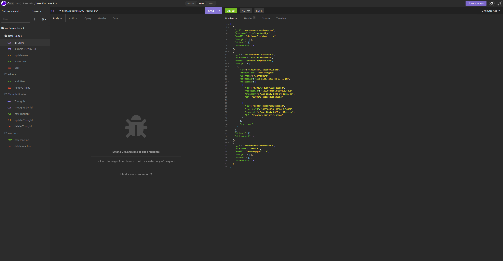

# 
  	




## Table of Contents
- [Description](#description)
- [User Story](#user-story)
- [Acceptance Criteria](#acceptance-criteria)
- [Installation](#installation)
- [Contributing](#contributing)

## Description
This is a backend API for a social media site that allows Users to share profound thoughts. This API can create and delete users and allow users to post there thoughts. Each thought is associated with a user. Thoughts can also be deleted, or they can be "reacted" to, reactions can be removed as well. Users can also become friends which is tracked document.

   

## User Story 
```
AS A social media startup
I WANT an API for my social network that uses a NoSQL database
SO THAT my website can handle large amounts of unstructured data
```
## Acceptance Criteria
```
GIVEN a social network API
WHEN I enter the command to invoke the application
THEN my server is started and the Mongoose models are synced to the MongoDB database
WHEN I open API GET routes in Insomnia for users and thoughts
THEN the data for each of these routes is displayed in a formatted JSON
WHEN I test API POST, PUT, and DELETE routes in Insomnia
THEN I am able to successfully create, update, and delete users and thoughts in my database
WHEN I test API POST and DELETE routes in Insomnia
THEN I am able to successfully create and delete reactions to thoughts and add and remove friends to a user’s friend list
```

## Installation
`npm i` 


## Contributing

Made by Chris Manfredi